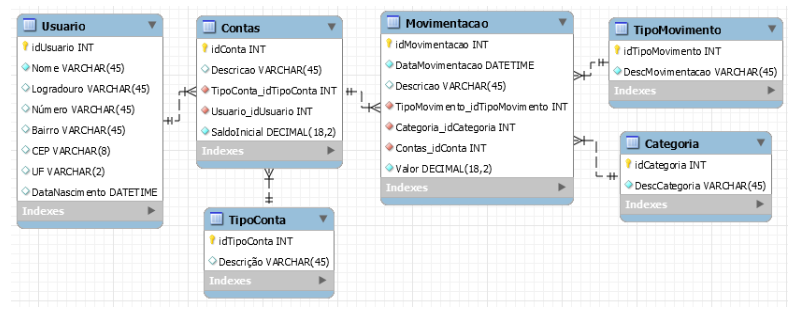

# **Processador-Consultas**
Implementação de um **Processador de Consultas** em **Python 3**.

### **Funcionalidades principais**
1. Parser (Análise) de uma consulta SQL;
2. Geração do grafo de operadores da consulta;
3. Ordem de execução da consulta;
4. Exibição dos resultados na interface gráfica

### **Conteúdo**
1. [**As maravilhosas expressões regulares**](#as-maravilhosas-expresões-regulares-utilizadas)
    1. [**Detectando cláusulas SQL**](#detecção-das-cláusulas-sql)
    2. [**Verificando a estrutura de um comando MySQL**](#verificação-de-estrutura-de-um-comando-mysql)
    3. [**Validando os parâmetros do SELECT**](#validação-dos-parâmetros-do-select)
    4. [**Validando os parâmetros do FROM**](#validação-dos-parâmetros-do-from)
    5. [**Validando os parâmetros do JOIN**](#validação-dos-parâmetros-do-join)
    6. [**Validando os parâmetros do ON**](#validação-dos-parâmetros-do-on)
    7. [**Validando os parâmetros do WHERE**](#validação-dos-parâmetros-do-where)
    8. [**Validando os parâmetros do AND**](#validação-dos-parâmetros-do-and)
    9. [**Validando os parâmetros do IN**](#validação-dos-parâmetros-do-in)
    10. [**Validando os parâmetros do NOT IN**](#validação-dos-parâmetros-do-not-in)
2. [**Exemplos Disponíveis para testes**](#banco-de-dados-exemplar-fornecido)

##### O Parser está **LIMITADO** para *"Select", "From", "Where", "Join On"* e, também, para os operadores *"=", ">", "<", "<=", ">=", "<>", "And", "In", "Not In", "(", ")"*.

## **As maravilhosas Expresões Regulares utilizadas.**
#### **Detecção das cláusulas SQL**
`(?<!\()\b(select|from|join|on|where|and|in|not\s+in)\b(?!([^()]*\)))|(;$)`
* `(?<!\()` - Verifica se algum grupo não possui um **(** no começo. 
* `\b` - Delimitador, indica que alguma coisa deve começar, ou terminar *(depende de sua posição no RegEx)*, com um caractere específico.
* `(select|from|join|on|where|and|in|not\s+in)` - Captura em um grupo as seguintes palavras: *"select, from, join, on, and, in, not in"* ou *"where"*.
* `(?!([^()]*\)))` - Garante que não haja um um parêntese de fechamento após o ponto atual da verificação, o que significa que o padrão correspondente não está dentro de um par de parênteses.
* `|` - Operador *OR*.
* `(;&)` - Captura em um grupo o *";"*, porém este deve estar localizado ao final de um texto.
> Essa expressão regular tem como objetivo separar algumas *palavras reservadas* do comando SQL.

#### **Verificação de estrutura de um comando MySQL**
`^select\sfrom\s(?:join\son\s((and|in|not\sin)\s)*?|where\s((and|in|not\sin)\s)*?)*;$`
* `^select\s` - Deve começar com um *select* seguido de qualquer quantia de espaços.
* `from\s` - Indica que a próxima palavra deve ser um *from* seguido de qualquer quantia de espaços.
* `(?:join\son\s|where\s)*` - Indica que a(s) próxima(s) palavra(s) devem ser um qualquer quantia de *join* *on*, separados por qualquer quantia de espaços OU qualquer quantia de *where*, também separados por qualquer quantia de espaços.
* `((and|in|not\sin)\s)*?` - Grupo opcional, operadores *and, in, not in* que podem ser usados 0 ou mais vezes no *join on* ou no *where*. 
* `;$` - O texto deve terminar com um *;*.
> No geral, esse RegEx é usado para verificar a estrutura do comando SQL, ou seja, o posicionamento das cláusulas SQL.

#### **Validação dos parâmetros do SELECT**
`\*|^([a-zA-Z]\w*\.)?[a-zA-Z]\w*(,[ ]*([a-zA-Z]\w*\.)?[a-zA-Z]\w*)*$`
* `\*` - Captura o *\**, é isso.
* `([a-zA-Z]\w*\.)?` - Captura um grupo OPCIONAL em que deve começar com uma letra minúscula ou maiúscula, seguida por qualquer quantia de letras, dígitos ou _ (underline), o texto deve terminar com um . (ponto), basicamente captura o formato *"nomeTabela."*
* `[a-zA-Z]\w*` - Captura o nome da coluna.
* `(,[ ]*([a-zA-Z]\w*\.)?[a-zA-Z]\w*)*` - Captura o que eu falei antes, podendo ser no formato *"nomeColuna"* ou *"nomeTabela.nomeColuna"* **N** vezes, sendo eles separados por uma vírgula.
* `$` - Final da linha.
> Basicamente o regex é usado para capturar parâmetros da cláusula SELECT, podendo ser um *\**, ou nos formatos *nomeTabela.nomeColuna* ou *nomeColuna*, ambos sendo separados por vírgulas e repetíveis qualquer quantia de vezes.

#### **Validação dos parâmetros do FROM**
`^[a-zA-Z]\w*(,[ ]*[a-zA-Z]\w*)*$`
* `^[a-zA-Z]\w*` - Captura um texto que deve começar com uma letra, minúscula ou maiúscula, seguida por qualquer quantia de letras, dígitos ou _ (underline).
* `(,[ ]*[a-zA-Z]\w*)*` - Captura textos separados por vírgulas com 0 ou mais espaços em brancos entre a vírgula e o texto, no qual o texto segue a mesma lógica do regex anterior.
* `$` - Final da linha.
> Pode-se dizer que esse regex é uma parte do regex dos parâmetros do SELECT, ele só pega entradas no formato "nomeTabela" e/ou "nomeTabela1, nomeTabela2". 

#### **Validação dos parâmetros do JOIN**
`^[a-zA-Z]\w*$`
* `^[a-zA-Z]` - Captura uma letra minúscula ou maiúscula no começo de um texto.
* `\w*` - Captura um caractere alfanumérico 0 ou N vezes ao longo do texto.
* `$` - Final da linha.
> Basicamente pega um texto qualquer que deve começar com uma letra, é isso.

#### **Validação dos parâmetros do ON**
`(?:(^[a-zA-Z]\w*)\.([a-zA-Z]\w*)|([a-zA-Z]\w*))\s(=|>|<|<=|>=|<>)\s(?:([a-zA-Z]\w*)\.([a-zA-Z]\w*)|([a-zA-Z]\w*)|([0-9]+)|(?:\'([a-zA-Z\d]\w*\s*)+\'))$|([a-zA-Z]\w*)$'`
* `(?:(^[a-zA-Z]\w*)\.([a-zA-Z]\w*)|([a-zA-Z]\w*))` - Captura um grupo no estilo "nomeTabela.nomeColuna" OU "nomeColuna", devendo começar com uma letra, minúscula ou maiúscula, e seguir com 0 ou mais caracteres alfanuméricos, incluindo o _ (underline).
* `\s(=|>|<|<=|>=|<>)\s` - Captura um grupo com 1 ou mais espaços em branco no começo e no final do texto, contendo um operador no meio, podendo ser: *=, <, >, <=, >=, <>**.
* `([a-zA-Z]\w*)` - Captura um texto alfanumérico qualquer, deve começar com uma letra minúscula ou maiúscula.
* `([0-9]+)` - Captura um grupo numérico (somente inteiros).
* `(?:\'([a-zA-Z\d]\w*\s*)+\'))`- Captura um texto, ou número, com aspas simples.
* `$` - Final da linha.
> Basicamente captura uma condicional.

#### **Validação dos parâmetros do WHERE**
> Mesma expressão regular utilizada para **validação dos parâmetros do ON**.

#### **Validação dos parâmetros do AND**
`(?:(^[a-zA-Z]\w*)\.([a-zA-Z]\w*)|([a-zA-Z]\w*))\s(=|>|<|<=|>=|<>)\s(?:([a-zA-Z]\w*)\.([a-zA-Z]\w*)|([a-zA-Z]\w*))$`
* `(?:(^[a-zA-Z]\w*)\.([a-zA-Z]\w*)|([a-zA-Z]\w*))` - Captura um grupo no estilo "nomeTabela.nomeColuna" OU "nomeColuna", devendo começar com uma letra, minúscula ou maiúscula, e seguir com 0 ou mais caracteres alfanuméricos, incluindo o _ (underline).
* `\s(=|>|<|<=|>=|<>)\s` - Captura um grupo com 1 ou mais espaços em branco no começo e no final do texto, contendo um operador no meio, podendo ser: *=, <, >, <=, >=, <>**.
* `$` - Final da linha.
> Basicamente captura uma condicional.

#### **Validação dos parâmetros do IN**
`\(\s*(?:(?:'(?:\\'|[^'])*')|(?:[0-9]+(?:\.[0-9]+)?(?:e[+-]?[0-9]+)?)|(?:true|True|false|False)|(?:null|NULL)|(?P<subcommand1>(?:(select|SELECT)\s+.+\s+(from|FROM)\s+.+)))\s*(?:,\s*(?:(?:'(?:\\'|[^'])*')|(?:[0-9]+(?:\.[0-9]+)?(?:e[+-]?[0-9]+)?)|(?:true|True|false|False)|(?:null|NULL)|(?P<subcommand2>(?:(select|SELECT)\s+.+\s+(from|FROM)\s+.+)))\s*)*\)`
###### *~~As expressões regulares tão ficando cada vez pior~~*
* `\(` - Um parêntese de abertura.
* `\s*` - Zero ou mais espaços em branco.
* `(?:(?:'(?:\\'|[^'])*')|(?:[0-9]+(?:\.[0-9]+)?(?:e[+-]?[0-9]+)?)|(?:true|True|false|False)|(?:null|NULL)|(?P<subcommand1>(?:(select|SELECT)\s+.+\s+(from|FROM)\s+.+)))` - Uma expressão regular que captura o conteúdo entre parênteses, essa expressão tem cinco opções:
    * `(?:'(?:\\'|[^'])*')` - Captura uma string delimitada por aspas simples, pode ser aspas escapadas *(\\' ou \\")*.
    * `(?:[0-9]+(?:\.[0-9]+)?(?:e[+-]?[0-9]+)?)` - Captura um número inteiro ou decimal, com ou sem notação científica.
    * `(?:true|True|false|False)` - Captura um valor booleano.
    * `(?:null|NULL)` - Captura um valor nulo.
    * `(?P<subcommand1>(?:(select|SELECT)\s+.+\s+(from|FROM)\s+.+))` -  Captura uma subconsulta SELECT, nomeada de "subcommand1".
    * `(?:,\s*(?:(?:'(?:\\'|[^'])*')|(?:[0-9]+(?:\.[0-9]+)?(?:e[+-]?[0-9]+)?)|(?:true|True|false|False)|(?:null|NULL)|(?P<subcommand2>(?:(select|SELECT)\s+.+\s+(from|FROM)\s+.+)))\s*)*` - É uma expressão regular que captura uma lista separada por vírgulas de qualquer combinação de strings, números, valores booleanos, valores nulos e subconsultas SELECT (nomeada de "subcommand2"). Cada item da lista é separado por uma vírgula, podendo ter zero ou mais espaços em branco.

#### **Validação dos parâmetros do NOT IN**
> Mesma expressão regular utilizada para **validação dos parâmetros do IN**.

## **Banco de Dados Exemplar fornecido**

> Usado no método `Parser.validate_command_in_example_context()`.